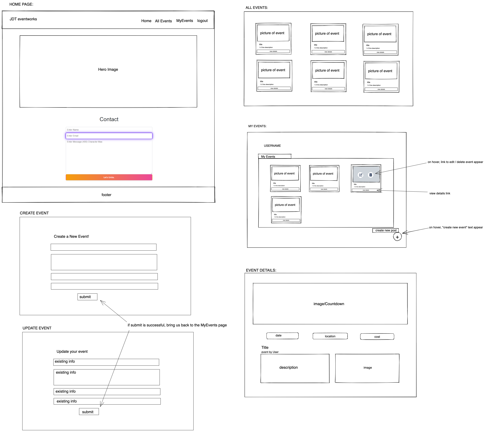

# UTOR-PROJECT-03 by Jocelyn, Devarsh & Thomas

[](https://opensource.org/licenses/MIT)

## Description.

Welcome to the JDT Event Manager, a MERN stack single-page application that allows users to create, manage, and attend events. Users can log in, sign up, and log out while managing their events efficiently. The application provides essential event details, such as location, date, time, and category.


## Table of Contents:
- [Overview](#Overview)
- [The Challenge](#The-Challenge)
- [Usage Information](#Usage-Information)
- [Installation Process](#Installation-Process)
- [Built With](#Built-With)
- [What I Learned](#What-I-Learned)
- [Continued Development](#Continued-Development)
- [License](#License)
- [Author](#Author)
- [Acknowledgments](#Acknowledgments)

# Overview

## The Challenge:

## The Challenge

The challenge for our team was to develop a comprehensive event management application that offers a user-friendly interface and extensive functionality. The application needed to enable users to create, edit, and manage their events while also providing the ability to discover and attend events created by others. Our application ensures a seamless user experience, offering secure, responsive, and accessible features across various devices and screen sizes.

Our objectives for this challenge were as follows:

1. Authentication, allowing users to sign up, log in, and log out securely.
2. Enable users to create, add, delete, and edit events, details include: location, date, time, and category.
3. Allow users to browse and filter events created by other users based on specific criteria such as location, date, time, and category.
4. Provide featurse for users to mark attendance at events view the events they are attending.
5. Ensure that the application is responsive and accessible on various devices and screen sizes.

Addressing these objectives, our teamed delivered an event management platform that met the needs of both event organizers and attendees, thus streamlining the event planning and participation process.


## Assigned User Story:
```
I want to be able to sign up, log in, and log out of the application securely.
I want to create, add, delete, and edit events with necessary details such as location, date, time, and category.
I want to browse events created by other users and filter them based on location, date, time, and category.
I want to mark my attendance to events and view the events I am attending.
I want the application to be responsive and accessible on various devices and screen sizes.
```

## Acceptance Criteria:
```
Users can sign up, log in, and log out of the application securely.
Logged-in users can create events, providing all required details (location, date, time, and category).
Users can add, delete, and edit their events.
Users can browse events created by other users.
Users can filter events by location, date, time, and category.
Users can mark their attendance to events.
The application has a responsive and polished UI.
The application is accessible on various devices and screen sizes.
```

## GIF:
### Figure 1. GIF.

#### The following animation demonstrates the application functionality:


## Usage Instructions:

1. 
2. 
3. 
4. 

## Deployed Application Link:
[Deployed Application Link:](https://github.com/ThomasCalle/UTOR-PROJECT-03)

## GitHub Repository:
[GitHub Repository:](https://github.com/ThomasCalle/UTOR-PROJECT-03)

## YouTube Walkthrough Video:
[Click Here to Watch](https://www.youtube.com/watch?v=TtLm6rTZ11I)

## Screenshots:
### Figure 1. Screenshot.


## Installation Process:
1. Clone the Repository from GitHub (or) Download Zip Folder from Repository from GitHub.
2. Open the cloned (or downloaded) repository in any source code editor.
3. Open the integrated terminal of the document and complete the respective installation guides provided in "Built With" to ensure the cloned documentation will operate.

## Built With:
- Saiyan Pride
- Dynamic JavaScript
- JSON: [JSON](https://www.npmjs.com/package/json)
- Mongoose: [7.0.3](https://www.npmjs.com/package/mongoose)
- Express: [4.18.2](https://www.npmjs.com/package/express)
- Node.js: [16.18.1](https://nodejs.org/en/blog/release/v16.18.1/)
- MongoDB: [Website](https://www.mongodb.com/)
- Nodemon: [2.0.12](https://www.npmjs.com/package/nodemon/v/2.0.12)
- Fontawesome: [6.4.0](https://www.npmjs.com/package/@fortawesome/)
- dotenv: [16.0.3](https://www.npmjs.com/package/dotenv)
- Express: [4.18.2](https://www.npmjs.com/package/express)
- GraphQL: [16.6.0](https://www.npmjs.com/package/graphql)
- JsonWebToken: [9.0.0](https://www.npmjs.com/package/jsonwebtoken)
- Mongodb: [5.1.0](https://www.npmjs.com/package/mongodb)
- Mongoose: [7.0.3](https://www.npmjs.com/package/mongoose)
- React: [18.2.0](https://www.npmjs.com/package/react)
- React-Dom: [18.2.0](https://www.npmjs.com/package/react-dom)
- React: [18.2.0](https://reactjs.org)
- GraphQL: [16.6.0](https://graphql.org)
- MongoDB: [5.1.0](https://www.mongodb.com)
- Mongoose ODM: [7.0.3](https://mongoosejs.com)
- JWT: [9.0.0](https://jwt.io)
- Heroku: [Website](https://www.heroku.com/platform)
- License Badge: [Shields.io](https://shields.io/)
- Visual Studio Code: [Website](https://code.visualstudio.com/)

## What I Learned:
1. How to build a full-stack application using the MERN stack (MongoDB, Express, React, and Node.js).
2. Implementing a GraphQL API with a Node.js and Express.js server.
3. Utilizing MongoDB and Mongoose ODM for database management.
4. Implemented user authentication using JWT.
5. Deploying a full MERN stack application on Heroku.

### Continued Development:
1. Intellect, Discipline & Strength.
2. Improve the user interface and user experience with more advanced design and functionality.
3. Add a feature to allow users to create private events, which are accessible only to invited attendees.
4. Implement real-time notifications for event updates and reminders.
5. Integrate a map view to display the location of events.
6. Add social media sharing functionality to promote events.
7. Implement event ratings and reviews.


## License & Copyright ©
  
[](https://opensource.org/licenses/MIT) [Open Source Initiative Link](https://opensource.org/licenses/MIT)

### Copyright © 2023 [Jocelynn](https://github.com/jjocelynn), [Dave](https://github.com/devarsh2395) & [Thomas](https://github.com/ThomasCalle)
```md
Permission is hereby granted, free of charge, to any person obtaining a copy
of this software and associated documentation files (the "Software"), to deal
in the Software without restriction, including without limitation the rights
to use, copy, modify, merge, publish, distribute, sublicense, and/or sell
copies of the Software, and to permit persons to whom the Software is
furnished to do so, subject to the following conditions:

The above copyright notice and this permission notice shall be included in all
copies or substantial portions of the Software.

THE SOFTWARE IS PROVIDED "AS IS", WITHOUT WARRANTY OF ANY KIND, EXPRESS OR
IMPLIED, INCLUDING BUT NOT LIMITED TO THE WARRANTIES OF MERCHANTABILITY,
FITNESS FOR A PARTICULAR PURPOSE AND NONINFRINGEMENT. IN NO EVENT SHALL THE
AUTHORS OR COPYRIGHT HOLDERS BE LIABLE FOR ANY CLAIM, DAMAGES OR OTHER
LIABILITY, WHETHER IN AN ACTION OF CONTRACT, TORT OR OTHERWISE, ARISING FROM,
OUT OF OR IN CONNECTION WITH THE SOFTWARE OR THE USE OR OTHER DEALINGS IN THE
SOFTWARE.
```

## Author

Follow me on Github at [Jocelynn](https://github.com/jjocelynn), [Dave](https://github.com/devarsh2395) & [Thomas](https://github.com/ThomasCalle). Additional questions or concerns? feel free to contact us.

Until next, adios!

© 2023 [Jocelynn](https://github.com/jjocelynn), [Dave](https://github.com/devarsh2395) & [Thomas](https://github.com/ThomasCalle). Confidential and Proprietary. All Rights Reserved.

# Temporary Section, Team Resources
- GoogleDoc Resources [Click link](https://docs.google.com/presentation/d/1xSmSx6JI7Qkwi-ORK2tc_wBxWhYAXE715pcw2VL5_o4/edit?usp=sharing)

